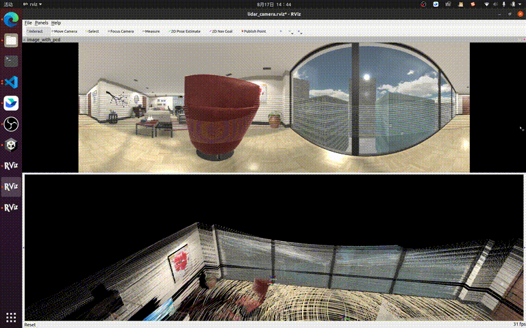

# omni_lidar_camera_fusion

Projecting LiDAR pointcloud onto equirectangular images and colorize the pcd.



## Dependencies

- OS: Ubuntu 20.04
- ROS: noetic
- PCL
- Eigen

## Installation

```sh
cd ros_ws/src

git clone https://github.com/LihanChen2004/omni_lidar_camera_fusion
```

```sh
cd ..

rosdep install -r --from-paths src --ignore-src --rosdistro $ROS_DISTRO -y

catkin_make
```

## Usage

Params are as shown in [omni_lidar_camera_fusion.yaml](./config/omni_lidar_camera_fusion.yaml)

```sh
source devel/setup.bash
roslaunch omni_lidar_camera_fusion lidar_camera_fusion.launch
```
